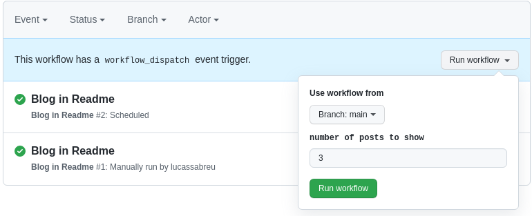

+++
date = "2021-10-15"
title = "Github Actions"
draft = false
tags = ["Github", "Github Actions", "Continuous Integration"]
toc = true
description = """
Como e onde podemos usar o Github Actions para automatizar os processos do
dia a dia de um repositório, e alguns outros usos interessantes que podemos
fazer com a API de eventos disponível.
"""
resources = ["./feature.png"]
+++

## O que é isso?

O Github Actions é primariamente uma ferramenta para implementar Continuous
Integration (CI), ou seja, automatizar a execução de ferramentas ou processos
que ajudam a garantir a qualidade do código, sejam teste unitários, análises de
código estática, analises de segurança, ou simplesmente compilar/"buildar" o
projeto.

Além disso também podemos implementar fluxos de Continuous Delivery (CD),
fazendo o deploy ou bundle do projeto de forma automática sempre que um evento
acontece, seja o `push` para uma branch, ou algum outro evento do Github.

Quase todas as ferramentas de CI permitem fazer esses tipos de coisa, mas o
interessante do Github Actions é que ele esta integrado com a API do Github,
então quando você quer usar funcionalidades do Github como os [commit
status][], [deployment status][], [checks/annotations][annotations] o processo
é bem simples.

## Como temos usado o Github Actions/CI

Para a maioria dos projetos da [Coderockr][] nós sempre adicionamos algumas
ferramentas para CI, que são executadas em todos os PRs e a maioria no `push`
para branchs "principais" (`main`, `develop`, `release`, etc).

Essas ferramentas fazem lint, analise estática e testes unitários; e todas elas
são "scriptáveis" e configuráveis, então podemos executar elas usando shell
scripts simples, capturar os arquivos com problema e suas falhas; e notificar a
pessoa desenvolvedora sobre os problemas e segurar o merge/deploy até os
problemas serem resolvidos.

## Como usar o Github Action para CI/CD

Mas beleza, nós temos as ferramentas, como integrar elas no Github Actions?
Para fazer qualquer coisa com Actions precisamos criar um `workflow`, que são
arquivos YAML que contem um ou mais conjuntos de passos a serem executados
quando um ou mais eventos acontecem.

```yaml {linenos=table}
name: "PHPUnit"
on:
  pull_request:
  push:
    branches: [main]

jobs:
  php-tests:
    runs-on: ubuntu-latest

    steps:
      - name: Checkout code
        uses: actions/checkout@v2

      - name: Setup PHP
        uses: shivammathur/setup-php@v2
        with:
          php-version: 8.0
          tools: composer:v2

      - name: Install dependencies
        run: composer install --prefer-dist

      - name: Execute Unit Tests
        run: php vendor/bin/phpunit
```
<p class="code-legend">exemplo de `workflow`</p>

Um `workflow` vai ser composto de três partes:

- `triggers` (gatilhos) que irão disparar o `workflow`. Linhas 2 a 5.
- `jobs` (trabalhos) representando um conjunto de ações sequenciais que
  compartilham  um mesmo ambiente virtual. Linhas 7 a 11
- `steps` (passos) que são executados em sequencia para executar um trabalho,
  podendo ser comandos de shell simples, imagens do Docker ou pacotes de
  ações. Cada um dos itens dentro de `steps` na linha 12 em diante.

Para adicionar o `workflow` que passei antes ao repositório basta fazer o
commit de um arquivo YAML dentro da pasta `.github/workflows`, e
automaticamente o Github irá utilizar ele assim que o evento que você definiu
acontecer com a branch que estiver (alguns eventos só vão funcionar se o
`workflow` estiver na branch padrão).

Esse é o tipo mais simples de `workflow` que pode ser feito no Github Actions,
executa a cada push para a `main` e em todos os `pull requests`, e a única
saída gerada é o "commit status".


Mas com isso já podemos bloquear `pull requests` que não atendem a qualidade
esperada, ou que quebrem algo no caso do PHPUnit; para todas as pessoas
desenvolvedoras do projeto o acesso ao porquê o commit não passou esta a apenas
um clique de distância.


## Lints/Análise Estática com annotations

Podemos fazer algumas coisas mais avançadas com o Github Actions e a integração
"auto-mágica" com a API do Github.

Uma integração que fora do Github Actions precisava de um setup chatinho para
fazer, mas que é muito boa para auxiliar no revisão automática PRs são os
[annotations][]. Com eles podemos criar "comentários" diretamente nos arquivos
do PR/repositório de forma automatizada, marcando inclusive qual a linha que
tem o problema e qual o problema daquela linha.


A vantagem é que agora quando formos revisar o PR podemos focar no design da
solução e regra de negócio que esta sendo implementada, no lugar de revisar se
o fonte possui problemas estruturais ou erros de compilação/interpretação.

Isso é claro depende do ferramental que a linguagem que você esta trabalhando
oferece, no caso do PHP quase todos os nossos projetos vão incluir o
[PHPStan][] (ou [Phan][]), [PHPMD][], [PHPCS][] e [PHP CS Fixer][] para
padronizar e analisar o código.

O exemplo da imagem anterior é feita com o seguinte `workflow`:

```yaml {linenos=table}
name: "PHPStan"
on:
  pull_request:
  push:
    branches: [main]

jobs:
  php-stan:
    runs-on: ubuntu-latest
    timeout-minutes: 15
    env:
      COMPOSER_NO_INTERACTION: 1

    steps:
      - name: Checkout code
        uses: actions/checkout@v2

      - name: Setup PHP
        uses: shivammathur/setup-php@v2
        with:
          php-version: 8.0
          tools: composer:v2

      - name: Install dependencies
        run: composer install --prefer-dist

      - name: Execute PHPStan
        run: php vendor/bin/phpstan analyse src --level 8 --error-format=github
```
<p class="code-legend">exemplo de workflow com phpstan</p>

O mesmo é basicamente igual ao `workflow` criado para o PHPUnit antes, mas
chamando o PHPStan dessa vez, e com isso ele já gera as `annotations`, isso
porque o Actions tem um conceito de "[workflow message commands][log-commands]".

O Actions interpreta a saída do `workflow` e se identificar um desses padrões
abaixo ele automaticamente cria uma `annotation` com o mesmo "nível de atenção"
no `pull request` (se o `workflow` estiver rodando para um PR).

```
::notice file={name},line={line},endLine={endLine},title={title}::{message}
::warning file={name},line={line},endLine={endLine},title={title}::{message}
::error file={name},line={line},endLine={endLine},title={title}::{message}
```

Então se eu criar um `step` como o abaixo:

```yaml {linenos=table,linenostart=18}
    - name: Fake
      run: |
        echo ::notice \
          file=$PWD/src/Hugger/Friendly.php,line=1,col=0::this is a notice
        echo ::warning \
          file=$PWD/src/Hugger/Friendly.php,line=1,col=0::this is a warning
        echo ::error \
          file=$PWD/src/Hugger/Friendly.php,line=1,col=0::this is a error
```

Vai gerar estas `annotations`:


Isso mostra quão fácil é integrar com essa funcionalidade do Github Actions, se
a ferramenta que você usa não suporta esse formato de saída você sempre pode
aplicar um [`sed`][sed] para resolver isso.

{}
Se não estiver usando o Github Actions, uma ferramenta que ajudou a gente na
integração foi o <https://github.com/roverdotcom/checkbridge>.

{}

## Integrações e "Actions"

Para a maioria das ferramentas, principalmente para as que podem/devem ser
executadas como parte do `pre-commit` usar o `step.run` é a melhor forma, ele é
fácil de entender e inclusive já mostra como executar a ferramenta sua própria
máquina. Se a pessoa desenvolvedora quiser ela não precisa fazer o push para
ver os se conseguiu resolver o problema, é só pegar o comando e executar no
terminal antes de fazer o commit e pronto.

Mas existem algumas etapas que podemos adicionar no `workflow` que não precisam
(talvez não devam) ser executadas localmente, por exemplo: deploys, cache de
arquivos, relatórios de cobertura, integrações com serviços externos, setup de
ferramentas para usar, etc.

Um exemplo simples é uma etapa para enviar o relatório de cobertura para o
[Codecov][]:

```yaml {linenos=table,hl_lines=["4-8"],linenostart=35}
      - name: Execute Unit Tests
        run: phpdbg -qrr vendor/bin/phpunit --coverage-clover=clover.xml

      - name: Upload coverage to Codecov
        uses: codecov/codecov-action@v2
        with:
          files: ./clover.xml
```

A etapa `Upload coverage to Codecov` usa uma `action` chamada
[`codecov/codecov-action`][codecov-action], `actions` são o que dão o nome para
a plataforma, e são plugins que podem ser adicionados aos `workflows` que
resolvem algum problema específico, que pode ser instalar o linguagem ou
ferramenta que você vai usar, como é o caso do `shivammathur/setup-php@v2`, ou
problemas como os que listei antes ou "receitas prontas" para alguma
ferramenta.

Diferente dos exemplos anteriores não passamos um script para ser executado na
etapa, mas sim qual o nome da `action` com o `uses` e (dependendo da `action`)
parâmetros complementares via `with`.

O Github tem um marketplace que você pode usar tanto para publicar os seus
próprios, quanto para procurar soluções prontas (por mais que o Google tenha
sido melhor para pesquisar, mas a pagina no marketplace ajuda o Google pelo
menos).


Podemos encontrar todo tipo de `action` pronta para ser adicionada aos
`workflows`, no meu blog eu não precisei escrever lógica para instalar o `hugo`
ou para "buildar" e fazer push dele para a branch `gh-pages`, isso tudo é feito
por `actions` que outras pessoas escreveram.

```yml {linenos=table,hl_lines=["17-20","25-29"]}
name: GH Pages
on:
  push:
    branches:
      - main

jobs:
  build-and-deploy:
    runs-on: ubuntu-latest
    steps:
      - name: Checkout 🛎️
        uses: actions/checkout@v2.3.1
        with:
          submodules: true
          fetch-depth: 0

      - name: Setup Hugo
        uses: peaceiris/actions-hugo@v2
        with:
          hugo-version: "0.87.0"

      - name: Build
        run: hugo -v --minify -b http://www.lucassabreu.net.br

      - name: Deploy 🚀
        uses: JamesIves/github-pages-deploy-action@4.1.5
        with:
          branch: gh-pages
          folder: public
```
{}
[.github/workflows/gh-pages.yaml][]
{}

### Docker Steps

Nós usamos o Docker para o desenvolvimento local e em produção para a maioria
dos projetos para manter os ambientes o mais próximos possível. E no [Drone
CI][] e [Buildkite][] usamos as mesmas imagens (ou bem próximas) para executar
as ferramentas de analise estática e testes unitários, porque se estamos usando
uma imagem customizada é provável que eles falhem por não ter a referencia a
alguma função ou classe.

Nesse sentido no lugar de usar uma `action` para instalar a linguagem e ainda
adicionar extensões ou customizações do ambiente, por mais que possível, acaba
sendo um trabalho duplicado, e sempre temos de lembrar de atualizar a imagem
base e o `workflow` toda vez, para evitar esse retrabalho nós usamos imagens do
Docker como etapas para rodar as operações.

Podemos configurar para o `job` usar um contêiner além do ambiente virtual,
alterando o primeiro `workflow` fica assim:

```diff
name: "PHPUnit (with Docker)"
on:
  pull_request:
  push:
    branches: [main]

jobs:
  php-tests:
    runs-on: ubuntu-latest
+    container:
+      image: ghcr.io/lucassabreu/php-with-exts-example:main
+      options: --user root

    steps:
      - name: Checkout code
        uses: actions/checkout@v2

-      - name: Setup PHP
-        uses: shivammathur/setup-php@v2
-        with:
-          php-version: 8.0
-          tools: composer:v2

      - name: Install dependencies
        run: composer install --prefer-dist

      - name: Execute Unit Tests
        run: phpdbg -qrr vendor/bin/phpunit --coverage-clover=clover.xml

      - name: Upload coverage to Codecov
        uses: codecov/codecov-action@v2
        with:
          files: ./clover.xml
```
<p class="code-legend">exemplo usando docker</p>

A imagem desse exemplo pode ser usada fora do Github, então eu tive de
adicionar o `--user root`, porque alguns `actions` precisam instalar pacotes (o
`actions/checkout@v2` instala o `git` e outras coisas).

Essa não é a única forma de usar imagens do Docker, se você ou a ferramenta que
você normalmente usa tiver uma imagem para ser usada, então pode adicionar a
mesma como um `step`:

```yaml {linenos=table,hl_lines=["15-18"]}
name: "PHPInsights"
on:
  pull_request:
  push:
    branches: [main]

jobs:
  check:
    runs-on: ubuntu-latest

    steps:
      - name: Checkout code
        uses: actions/checkout@v2

      - name: PHPInsights
        uses: docker://nunomaduro/phpinsights
        with:
          args: --format=github-action
```
<p class="code-legend">docker como um `step`</p>

Se ela tiver um formato de saída compatível com os [annotations commands][]
então fica parecendo que é uma `action` nativa.

Podemos ainda executar "Docker in Docker" se for necessário combinar a sua imagem
própria e usar outra imagem como um `step`.

```yaml {linenos=table,hl_lines=["10-12","21-27"]}
name: "PHPCS (Docker in Docker)"
on:
  pull_request:
  push:
    branches: [main]

jobs:
  check:
    runs-on: ubuntu-latest
    container:
      image: ghcr.io/lucassabreu/php-with-exts-example:main
      options: --user root

    steps:
      - name: Checkout code
        uses: actions/checkout@v2

      - name: Install dependencies
        run: composer install --prefer-dist

      - name: PHPCS
        uses: docker://phpqa/phpcs
        with:
          args: |
            sh -c "phpcs src --report=emacs \
              | sed \"s|^.*src|src|;s|\(.*\):\(.*\):\(.*\):\(.*\)|\
                ::error file=\1,line=\2,col=\3::\4|\""
```
<p class="code-legend">docker in docker</p>

### Secrets

Ainda tem um ponto importante para vários fluxos de CI (e principalmente
Continuous Delivery), que é lidar com informações sensíveis (chaves RSA, tokens
de acesso, JWTs, OAuth Client secrets, senhas).

Exceto se o seu CI esta integrado com o provedor que irá executar o seu
ambiente (Openshift/Kubernetes), é provável que você vai precisar ter alguma
chave para poder se conectar a sua VPS, seja para copiar arquivos via RSYNC,
fazer o push de imagens para registros do Docker, conectar via SSH, ou apenas
disparar algum evento no seu provedor.

E ter essa chave aberta no YAML do `workflow` esta longe de ser uma boa
prática, para resolver esse problema o Github permite que registremos valores
para o repositório que são acessíveis apenas dentro do `actions`.


Esses caras ficam disponíveis para todos os `workflows`, e pode ser usados
simplesmente usando o contexto `secrets` no YAML.

Por exemplo, se o seu repositório for privado, o Codecov obriga você a usar um
token para enviar o relatório de cobertura.

```yaml {linenos=table,hl_lines=["4"],linenostart=30}
      - name: Upload coverage to Codecov
        uses: codecov/codecov-action@v2
        with:
          token: ${{ secrets.CODECOV_TOKEN }}
          files: ./clover.xml
```

Agora sempre que o `workflow` for executado o Github vai automaticamente
injetar o segredo na `step`.

## Outros eventos e usos

Agora que temos uma ideia de como criar os `workflows` e também como combinar
`actions` prontas, seja do [Github Marketplace][marketplace] ou imagens do
Docker.

Vamos dar uma explorada em alguns outros eventos interessantes que podemos usar
nos `actions` que podem ser usados para alguns comportamentos customizados.

### CRON (`schedule`)

As CRONs no Github Actions rodam automaticamente com base numa periodicidade
que você definir, sempre usando a branch padrão do projeto.

Com esse evento podemos, por exemplo, avaliar se PRs ou Issues no Github estão
abertas por muito tempo, e dessa forma podem ser um risco, e marcar eles como
`stale`, ou notificar o time no Slack para não ser esquecida.

Também pode usá-lo para rodar processos que sejam muito grandes/lentos para se
executar num PR ou no merge da branch.

Uma coisa legal para automatizar e melhorar o seu perfil do Github, é o
`gautamkrishnar/blog-post-workflow`.

```yaml {linenos=table}
name: Wakatime
on:
  schedule:
    - cron: "0 0 * * *"

jobs:
  update-readme:
    name: Update this repo's README
    runs-on: ubuntu-latest
    steps:
      - uses: lucassabreu/waka-readme@master
        with:
          WAKATIME_API_KEY: ${{ secrets.WAKATIME_API_KEY }}
          SHOW_TIME: false
```

O [`gautamkrishnar/blog-post-workflow`][blog-action] consulta o RSS to seu blog
e insere as ultimas postagens que você fez, no caso essa CRON executa todo dia
a meia noite.


A expressão que vai na propriedade `cron` é o padrão [*POSIX*][cron-posix].

### Pull Request Labels (`labelled`)

Podemos ouvir quando são modificadas as `labels` de um PR e com isso podemos
automatizar a subida de ambientes quando formos testar o mesmo, ou visualizar
como uma postagem vai ficar sem de fato publicar ela nosso blog pessoal.

```yaml {linenos=table,hl_lines=["3-4","8"]}
name: GH Pages (Preview PR)
on:
  pull_request:
    types: [labeled]

jobs:
  build-and-preview:
    if: ${{ github.event.label.name == 'preview-pr' }}
    runs-on: ubuntu-latest
    steps:
      - name: Checkout 🛎️
        uses: actions/checkout@v2.3.1
        with:
          submodules: true
          fetch-depth: 0

      - name: Setup Hugo
        uses: peaceiris/actions-hugo@v2
        with:
          hugo-version: "0.87.0"

      - name: Build
        run: |
          REL=preview/${{ github.event.number }}
          hugo -d public/$REL -v --minify \
            -b http://www.lucassabreu.net.br/$REL

      - name: Deploy 🚀
        uses: JamesIves/github-pages-deploy-action@4.1.5
        with:
          branch: gh-pages
          folder: public
          clean: false
```
{}
[.github/workflows/render-preview.yaml](https://github.com/lucassabreu/lucassabreu.github.io/blob/6a466ef778bd446b47fc6452fa6775b9c4f07f83/.github/workflows/render-preview.yaml)
{}

Se quiser ainda pode usar o `actions/github-script` para remover a `label` no
fim do deploy, e colocar outra para indicar que concluiu. Mas já deixar pronto
para iniciar o deploy de novo.

```yaml {linenos=table,linenostart=35}
      - uses: actions/github-script@v4
        with:
          script: |
            github.issues.removeLabel({
              owner: context.repo.owner,
              repo: context.repo.repo,
              issue_number: context.payload.number,
              name: 'preview-pr'
            })
            github.issues.addLabels({
              owner: context.repo.owner,
              repo: context.repo.repo,
              issue_number: context.payload.number,
              labels: ['preview-deployed']
            })
```
<p class="code-legend">apenas um extra para facilitar</p>

Para fazer com todos os commits feitos para o PR passem a fazer o deploy depois
de adicionar a `label`, é só caso de mudar um pouco o cabeçalho do `workflow`:

```yaml {linenos=table,hl_lines=["8-12"]}
name: GH Pages (Preview PR)
on:
  pull_request:
    types: [labeled, opened, synchronize, reopened]

jobs:
  build-and-preview:
    if: |
      ${{
        github.event.label.name == 'preview-pr' ||
        contains(github.event.pull_request.labels.*.name, 'preview-deployed')
      }}
    runs-on: ubuntu-latest
```

### Comentários (`issue_comment`)

Ouvindo os comentários é possível criar comportamentos ainda mais complexos,
podemos até criar um mini "chat bot" que reage a comentários específicos ou a
padrões de comando, que nem o bots do Slack ou do Discord.

Como esse `workflow` reage a eventos que não tem necessariamente relação a
código ele precisa estar estar na branch padrão para funcionar, então se for
criar alguma automação para um PR você não vai conseguir testar ele até chegar
na `main`.

Usando a API do Github da para fazer a uma versão no [`cowsay`][cowsay] via
comentários.

```yaml
name: "Octocat say"
on:
  issue_comment:
    types: [created]

jobs:
  cowsay:
    if: "${{ startsWith(github.event.comment.body, '/say') }}"
    runs-on: ubuntu-latest

    steps:
      - name: Octocat says
        uses: actions/github-script@v5
        with:
          script: |
            const message = context.payload.comment.body.substring(5) ||
              (await github.rest.meta.getZen()).data;
            const say = await github.rest.meta.getOctocat({
              s: message
            });
            github.rest.issues.createComment({
              owner: context.repo.owner,
              repo: context.repo.repo,
              issue_number: context.payload.issue.number,
              body: "```\n" + (new TextDecoder().decode(say.data)) + "\n```",
            });
```
<p class="code-legend">`workflow` para responder comentários</p>

O `workflow` acima pode gerar esses dois resultados:


E aqui abre as portas da criatividade...

* iniciar um deploy e passar um prefixo para ser usado? _Dá para fazer!_
* promover a branch do PR para um ambiente específico? _Dá para fazer!!_
* mandar uma cópia do comentário que acabou de escrever e os últimos
comentários feitos no PR para um canal específico no Slack para continuar a
conversar de forma mais síncrona? _Dá para fazer!!!_

### Manual (`workflow_dispatch` e `repository_dispatch`)

O `workflow_dispatch` e o `repository_dispatch` atende a situação em que você
precisa iniciar um `workflow` para reagir a algum evento externo ao Github,
ele até pode ser automático do ponto de vista do seu processo, mas para o Github é
praticamente o equivalente a um webhook.

Similar ao `issue_comment` como esses `workflows` reagem a ações não
necessariamente relacionadas a PRs, você vai precisar que eles estejam na
branch padrão para funcionar.

Como nos outros casos, aqui é uma questão de criatividade e necessidade quanto
ao que pode ser feito, o mais comum é criar um `workflow` para deploy do
projeto onde você pode informar qual o ambiente que será atualizado e qual
referencia usar.

#### `workflow_dispatch`

Dos dois o `workflow_dispatch` é o mais orientado a ideia de um humano
disparando o mesmo, tendo uma sessão para descrever as entradas que ele espera
e uma UI do Github com base nessas entradas para facilitar o disparo.

É interessante vincular o `workflow_dispatch` a todos os `workflows` que sejam
CRONs, pois o Github trata eles de forma especial e mostra um botão para rodar
diretamente da aba "Actions" do repositório.

Um outro diferencial é permitir declarar entradas customizadas para serem
usadas nos `jobs`, essa entradas vão ser lidas pelo Github e ele vai criar um
formulário para informá-las quando clicar no botão "run workflow".



Para gerar o formulário acima, você cria um YAML como o abaixo:

```yaml {linenos=table,hl_lines=["5-9","19"]}
name: Blog in Readme

on:
  workflow_dispatch:
    inputs:
      postsCount:
        description: number of posts to show
        required: false
        default: 3

jobs:
  update:
    runs-on: ubuntu-latest
    steps:
      - uses: actions/checkout@v2
      - uses: gautamkrishnar/blog-post-workflow@master
        with:
          feed_list: https://www.lucassabreu.net.br/index.xml
          max_post_count: ${{ github.event.inputs.postsCount || 3 }}
```

Um `workflow` podem ter várias entradas, é apenas o caso de repetir a estrutura
do `postsCount` varias vezes, sendo que cada um deve ter um nome único. Os
valores dos `inputs` vão ser adicionados ao contexto `github.event.inputs`
e podem ser usadas como qualquer outro contexto.

Como a imagem sugere você pode rodar o `workflow` em outras branchs que não a
padrão, uma coisa que a interface do Github não permite, mas que usando o
[`gh`][gh] ou API você consegue é usar uma tag/release como a referencia.

```
❯ gh workflow run blog.yml -f postsCount=5 --ref v0.1
✓ Created workflow_dispatch event for blog.yml at v0.1

To see runs for this workflow, try: gh run list --workflow=blog.yml
```

#### `repository_dispatch`

O `repository_dispatch` também é considerado um "evento manual", mas diferente
do `workflow_dispatch` que indica a execução de um `workflow` apenas, este pode
disparar um ou mais `workflows` a um evento customizado do no repositório.

Ouvir eventos customizados permite que possamos iniciar o `workflow` sem saber
o ID do mesmo, ou sequer o arquivo. Então se você tiver processos externos ao
Github que você gostaria que executassem algo no repositório você pode fazer uma
chamada como a abaixo.

```sh
curl -vs "https://api.github.com/repos/${owner}/${repo}/dispatches" \
  -H "content-type: applicatin/json" -H "accept: application/vnd.github.v3+json" \
  -H "authorization: bearer ${GITHUB_TOKEN}" \
  -d '{"event_type": "update-collaborators-contribution"}'
```

E para ouvir esse evento customizado você precisa ter um `workflow` como esse
aqui na sua branch padrão:

```yaml {linenos=table,hl_lines=["4-5"]}
name: Compile Contributions

on:
  repository_dispatch:
    types: ["update-collaborators-contribution"]

jobs:
  compile:
    runs-on: ubuntu-latest
    steps:
      - run: echo "something?"
```

Caso seja necessário fornecer algum parâmetro específico para o `workflow`
você pode passar um objeto JSON no campo `client_payload` com eles.

Alterando o exemplo do `workflow_dispatch` para suportar o
`repository_dispatch` ficaria assim:

```yaml {linenos=table,hl_lines=["4-5","24"]}
name: Blog in Readme

on:
  repository_dispatch:
    types: [ update-readme ]
  workflow_dispatch:
    inputs:
      postsCount:
        description: number of posts to show
        required: false
        default: 3

jobs:
  update:
    runs-on: ubuntu-latest
    steps:
      - uses: actions/checkout@v2
      - uses: gautamkrishnar/blog-post-workflow@master
        with:
          feed_list: https://www.lucassabreu.net.br/index.xml
          max_post_count: |
            ${{
              github.event.inputs.postsCount ||
              github.event.client_payload.postsCount ||
              3
            }}
```

Se por algum motivo eu resolver que quero mostrar 10 post é executar um `CURL`
com o `client_payload` no corpo.

```sh
curl -vs "https://api.github.com/repos/${owner}/${repo}/dispatches" \
  -H "content-type: applicatin/json" -H "accept: application/vnd.github.v3+json" \
  -H "authorization: bearer ${GITHUB_TOKEN}" \
  -d '{"event_type": "update-readme","client_payload":{"postsCount": 10}}'
```

---

{}
Caso queira ver o fonte como um todo, ou mais exemplos de `workflow`, eu usei o
fonte presente nesses repositórios: 
 * [lucassabreu/github-actions-examples][]
 * [lucassabreu/lucassabreu][]
 * [lucassabreu/lucassabreu.github.io][]
{}

[dind]: https://github.com/lucassabreu/github-actions-examples/blob/da3b1d7e069f24115d9ce750acf9178814c9a1a3/.github/workflows/phpcs-dind.yaml
[lucassabreu/github-actions-examples]: https://github.com/lucassabreu/github-actions-examples
[lucassabreu/lucassabreu]: https://github.com/lucassabreu/lucassabreu/tree/main/.github/workflows
[lucassabreu/lucassabreu.github.io]: https://github.com/lucassabreu/lucassabreu.github.io/tree/main/.github/workflows
[gh]: https://github.com/cli/cli
[Drone CI]: https://www.drone.io/
[Buildkite]: https://buildkite.com/
[Coderockr]: https://coderockr.com
[commit status]: https://docs.github.com/en/rest/reference/repos#statuses
[deployment status]: https://docs.github.com/en/rest/reference/repos#deployments
[annotations]: https://docs.github.com/en/github/collaborating-with-pull-requests/collaborating-on-repositories-with-code-quality-features/about-status-checks#checks
[dispatch]: #manual-workflow_dispatch-e-repository_dispatch
[PHPStan]: https://github.com/phpstan/phpstan
[Phan]: https://github.com/phan/phan
[PHPMD]: https://phpmd.org/
[PHPCS]: https://github.com/squizlabs/PHP_CodeSniffer
[PHP CS Fixer]: https://cs.symfony.com/
[Codecov]: https://about.codecov.io/
[marketplace]: https://github.com/marketplace/actions
[codecov-action]: https://github.com/marketplace/actions/codecov
[log-commands]: https://docs.github.com/en/actions/reference/workflow-commands-for-github-actions
[sed]: https://github.com/lucassabreu/github-actions-examples/blob/f051cee06d489998f90e4e4cb6fc71afcc5fc7ca/.github/workflows/phpcs.yaml#L35-L38
[action-yaml]: https://docs.github.com/en/actions/creating-actions/metadata-syntax-for-github-actions
[annotations commands]: #lintsanalise-estática-com-annotations
[wakatime]: https://wakatime.com/
[waka-action]: https://github.com/athul/waka-readme
[blog-action]: https://github.com/gautamkrishnar/blog-post-workflow
[cowsay]: https://en.wikipedia.org/wiki/Cowsay
[.github/workflows/gh-pages.yaml]: https://github.com/lucassabreu/lucassabreu.github.io/blob/6a466ef778bd446b47fc6452fa6775b9c4f07f83/.github/workflows/gh-pages.yaml
[cron-posix]: https://en.wikipedia.org/wiki/Cron
